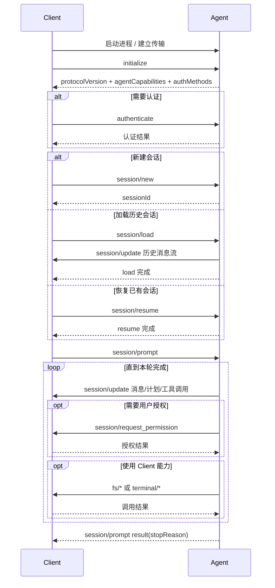

# ACP 协议与流程整理

整理日期：2026-06-01  
主要来源：[ACP Overview](https://agentclientprotocol.com/protocol/v1/overview)、[Initialization](https://agentclientprotocol.com/protocol/v1/initialization)、[Session Setup](https://agentclientprotocol.com/protocol/v1/session-setup)、[Prompt Turn](https://agentclientprotocol.com/protocol/v1/prompt-turn)

## 1. ACP 是什么

ACP，全称 Agent Client Protocol，是一种用于规范 AI Agent 与客户端应用之间通信的协议。它的典型场景是：代码编辑器、IDE、桌面客户端等作为 Client，启动并连接一个具备代码理解、代码修改、工具调用能力的 Agent。

ACP 关注的不是模型 API 本身，而是“用户界面/编辑器如何和 Agent 协作”。它为以下事情提供标准化接口：

- Client 如何初始化连接、声明自身能力。
- Agent 如何声明协议版本、认证方式、可用能力。
- Client 如何创建、加载、恢复、关闭会话。
- Client 如何向 Agent 发送用户提示词。
- Agent 如何流式汇报回复、计划、工具调用、文件修改、终端输出。
- Agent 如何向 Client 请求权限、读取/写入文件、运行终端命令。

ACP 当前 v1 使用 [JSON-RPC 2.0](https://www.jsonrpc.org/specification) 作为消息格式。消息分为两类：

- Method：请求-响应式消息，调用方带 `id`，接收方必须返回 `result` 或 `error`。
- Notification：单向通知，不带 `id`，接收方不返回响应。

## 2. 参与方

### 2.1 Client

Client 是用户直接使用的界面层，常见形态是代码编辑器、IDE、文本编辑器或其他 Agent UI。Client 负责：

- 管理用户交互。
- 启动 Agent 进程。
- 提供工作目录、MCP Server 配置、文件系统能力、终端能力。
- 展示 Agent 的消息、计划、工具调用、文件 diff、终端输出。
- 在需要时向用户请求授权，并把授权结果返回给 Agent。

### 2.2 Agent

Agent 是具备生成式 AI 能力的程序，通常由 Client 作为子进程启动。Agent 负责：

- 接收用户 prompt。
- 调用语言模型。
- 规划任务、执行工具、修改代码。
- 通过 `session/update` 向 Client 流式报告过程和结果。
- 必要时调用 Client 暴露的方法，例如请求权限、读取文件、写入文件、创建终端。

### 2.3 MCP Server

ACP 可以携带 MCP Server 配置。Client 在创建或加载会话时，把 MCP Server 信息传给 Agent，Agent 再直接连接这些 MCP Server。这样 Agent 可以访问外部工具、数据源或由 Client 自身暴露的 MCP 工具。

## 3. 传输与消息约束

ACP 消息必须是 UTF-8 编码的 JSON-RPC 消息。

当前稳定的推荐传输方式是 `stdio`：

- Client 启动 Agent 子进程。
- Client 通过 Agent 的 `stdin` 写入 JSON-RPC 消息。
- Agent 通过 `stdout` 输出 JSON-RPC 消息。
- 每条消息用换行符 `\n` 分隔。
- `stdout` 只能输出合法 ACP 消息。
- Agent 可以向 `stderr` 写日志，Client 可以选择收集、转发或忽略。

协议本身是传输无关的，也允许实现自定义传输，但必须保留 ACP 的 JSON-RPC 消息格式和生命周期要求。Streamable HTTP 仍处于草案讨论阶段。

## 4. 总体流程

ACP 的典型生命周期可以分为四段：

1. 建立连接：Client 启动或连接 Agent。
2. 初始化：Client 调用 `initialize`，双方协商协议版本和能力。
3. 会话准备：Client 创建新会话，或加载/恢复已有会话。
4. Prompt Turn：Client 发送用户消息，Agent 流式返回消息、计划、工具调用和最终停止原因。



## 5. 初始化流程

所有会话创建之前，Client 必须先调用 `initialize`。

Client 在 `initialize` 中提供：

- `protocolVersion`：Client 支持的最新主版本号。
- `clientCapabilities`：Client 支持的能力。
- `clientInfo`：Client 名称、展示标题、版本等实现信息，推荐提供。

Agent 返回：

- `protocolVersion`：双方实际使用的协议主版本。
- `agentCapabilities`：Agent 支持的能力。
- `agentInfo`：Agent 名称、展示标题、版本等实现信息，推荐提供。
- `authMethods`：Agent 支持的认证方式列表。

版本协商规则：

- Client 必须在请求中发送自己支持的最新协议版本。
- 如果 Agent 支持该版本，返回相同版本。
- 如果不支持，Agent 返回自己支持的最新版本。
- 如果 Client 不支持 Agent 返回的版本，Client 应关闭连接并提示用户。

能力协商规则：

- 能力字段都是可选的。
- 未声明的能力必须视为不支持。
- 新增能力不视为破坏性变更。
- 实现方应能处理对端能力的各种组合。

常见 Client 能力：

| 能力 | 含义 |
| --- | --- |
| `fs.readTextFile` | Agent 可以调用 `fs/read_text_file` 读取 Client 环境中的文本文件 |
| `fs.writeTextFile` | Agent 可以调用 `fs/write_text_file` 写入文本文件 |
| `terminal` | Agent 可以调用 `terminal/*` 创建、读取、等待、终止、释放终端命令 |

常见 Agent 能力：

| 能力 | 含义 |
| --- | --- |
| `loadSession` | 支持 `session/load` 加载已有会话并回放历史 |
| `promptCapabilities.image` | `session/prompt` 可以包含图片内容 |
| `promptCapabilities.audio` | `session/prompt` 可以包含音频内容 |
| `promptCapabilities.embeddedContext` | `session/prompt` 可以包含嵌入资源内容 |
| `mcpCapabilities.http` | 支持通过 HTTP 连接 MCP Server |
| `mcpCapabilities.sse` | 支持通过 SSE 连接 MCP Server，注意该传输在 MCP 规范中已废弃 |
| `auth.logout` | 支持 `logout` |
| `sessionCapabilities.resume` | 支持 `session/resume` |
| `sessionCapabilities.close` | 支持 `session/close` |

## 6. 认证流程

认证不是所有 Agent 都需要，但如果 Agent 需要认证，它会在 `initialize` 响应里的 `authMethods` 中声明可用认证方式。

认证流程：

1. Client 调用 `initialize`。
2. Agent 返回 `authMethods`。
3. 如果 Agent 要求认证，Client 选择一个 `methodId` 调用 `authenticate`。
4. Agent 返回空对象表示认证成功。
5. 之后 Client 可以继续创建会话。

如果 Agent 在 `agentCapabilities.auth.logout` 中声明支持登出，Client 可以调用 `logout` 结束当前认证状态。协议不保证登出后已运行会话的行为，Agent 可以终止会话、保留会话，或在后续请求中返回认证相关错误。

## 7. 会话流程

Session 表示 Client 与 Agent 之间的一条独立对话或任务线程。一个连接可以承载多个并发 Session。

会话响应中除了 `sessionId`，Agent 还可以返回会话级状态，例如：

- `configOptions`：推荐的会话配置选项机制。
- `modes`：旧的会话模式机制，仍可用于兼容旧 Client，但未来会被移除。

### 7.1 新建会话：`session/new`

Client 调用 `session/new` 创建新会话，请求中通常包含：

- `cwd`：会话工作目录，必须是绝对路径。
- `mcpServers`：希望 Agent 连接的 MCP Server 列表。

Agent 返回：

- `sessionId`：该会话的唯一标识。

后续的 `session/prompt`、`session/cancel`、文件系统请求、终端请求等都会携带这个 `sessionId`。

### 7.2 加载会话：`session/load`

如果 Agent 声明了 `loadSession`，Client 可以调用 `session/load` 加载历史会话。

加载时 Client 提供：

- `sessionId`
- `cwd`
- `mcpServers`

Agent 必须通过一系列 `session/update` 通知把完整会话历史回放给 Client。所有历史内容流式发送完后，Agent 才返回原始 `session/load` 请求的响应。

适用场景：Client 需要重建 UI 中的完整会话历史。

### 7.3 恢复会话：`session/resume`

如果 Agent 声明了 `sessionCapabilities.resume`，Client 可以调用 `session/resume` 重新连接已有会话。

与 `session/load` 不同，`session/resume` 不回放历史消息。Agent 只恢复上下文、重连 MCP Server，并在准备好继续对话后返回。

适用场景：Client 已有历史状态，只需要重新接上 Agent 会话。

### 7.4 关闭会话：`session/close`

如果 Agent 声明了 `sessionCapabilities.close`，Client 可以调用 `session/close` 关闭活动会话。

Agent 必须像收到 `session/cancel` 一样取消该会话的进行中工作，然后释放相关资源。成功时返回空对象。

## 8. Session Config Options

Session Config Options 是 ACP 推荐使用的会话级配置机制。Agent 可以在会话创建、加载或恢复时返回 `configOptions`，让 Client 为用户展示模型、模式、推理强度等配置选择器。

如果 Agent 同时提供 `configOptions` 和旧的 `modes` 字段，支持配置选项的 Client 应优先使用 `configOptions`，并忽略 `modes`。

### 8.1 初始状态

Agent 可以在会话设置响应中返回完整配置列表：

```json
{
  "sessionId": "sess_abc123def456",
  "configOptions": [
    {
      "id": "mode",
      "name": "Session Mode",
      "description": "Controls how the agent requests permission",
      "category": "mode",
      "type": "select",
      "currentValue": "ask",
      "options": [
        {
          "value": "ask",
          "name": "Ask",
          "description": "Request permission before making any changes"
        },
        {
          "value": "code",
          "name": "Code",
          "description": "Write and modify code with full tool access"
        }
      ]
    }
  ]
}
```

`configOptions` 数组顺序有语义，表示 Agent 推荐的展示优先级。Client 应尽量按该顺序展示，空间有限时优先展示靠前项。

### 8.2 配置项结构

每个配置项包含：

| 字段 | 说明 |
| --- | --- |
| `id` | 配置项唯一 ID，设置值时作为 `configId` 使用 |
| `name` | 面向用户的名称 |
| `description` | 可选说明 |
| `category` | 可选语义分类，用于帮助 Client 做 UI 决策 |
| `type` | 输入控件类型，当前稳定支持 `select` |
| `currentValue` | 当前选中的值，Agent 必须提供默认值 |
| `options` | 可选值列表 |

每个 `options` 值包含：

| 字段 | 说明 |
| --- | --- |
| `value` | 设置该配置时传递的值 |
| `name` | 面向用户的名称 |
| `description` | 可选说明 |

### 8.3 配置分类

`category` 是给 Client 做一致 UX 的语义提示，不应作为正确性依赖。Client 必须能优雅处理缺失或未知分类。

ACP 当前保留的分类包括：

| 分类 | 含义 |
| --- | --- |
| `mode` | 会话模式选择器 |
| `model` | 模型选择器 |
| `thought_level` | 思考/推理强度选择器 |

以下划线 `_` 开头的分类可用于自定义扩展，例如 `_my_custom_category`。不以下划线开头的分类由 ACP 规范保留。

### 8.4 Client 设置配置项

Client 可以在会话空闲或 Agent 正在生成时调用 `session/set_config_option` 修改配置：

```json
{
  "jsonrpc": "2.0",
  "id": 2,
  "method": "session/set_config_option",
  "params": {
    "sessionId": "sess_abc123def456",
    "configId": "mode",
    "value": "code"
  }
}
```

参数要求：

- `sessionId`：目标会话。
- `configId`：要修改的配置项 ID。
- `value`：新的值，必须来自该配置项的 `options` 列表。

Agent 必须返回完整的 `configOptions` 当前状态，而不是只返回被修改的一项。这样 Agent 可以表达配置之间的联动关系，例如切换模型后，可用推理强度也发生变化。

### 8.5 Agent 主动更新配置

Agent 也可以通过 `session/update` 发送 `config_option_update`，主动告诉 Client 配置状态变了：

```json
{
  "jsonrpc": "2.0",
  "method": "session/update",
  "params": {
    "sessionId": "sess_abc123def456",
    "update": {
      "sessionUpdate": "config_option_update",
      "configOptions": [
        {
          "id": "mode",
          "name": "Session Mode",
          "type": "select",
          "currentValue": "code",
          "options": []
        }
      ]
    }
  }
}
```

这个通知也必须携带完整配置状态。常见原因包括：

- 规划阶段结束后自动切换模式。
- 模型限流或报错后切换到备用模型。
- 根据上下文动态调整可用选项。

### 8.6 降级与兼容

Agent 必须为每个配置项提供默认值，保证 Client 不支持配置选项、选择不展示某些配置、或遇到未知 `type` 时，Agent 仍能正常运行。

如果 Client 遇到未知 `type`，应忽略该配置项，让 Agent 继续使用默认值。

## 9. Session Modes

Session Modes 是 ACP 早期用于切换 Agent 工作模式的 API。它仍可用于兼容旧 Client，但官方推荐改用 Session Config Options。未来协议版本会移除专用的 session mode 方法。

模式通常会影响：

- Agent 使用的 system prompt。
- 可用工具集合。
- 是否在执行操作前请求用户授权。

常见模式示例：

| 模式 ID | 含义 |
| --- | --- |
| `ask` | 修改前请求权限 |
| `architect` | 只设计和规划，不直接实现 |
| `code` | 编写和修改代码，通常具备更完整工具访问 |

### 9.1 初始状态

Agent 可以在会话设置响应中返回 `modes`：

```json
{
  "sessionId": "sess_abc123def456",
  "modes": {
    "currentModeId": "ask",
    "availableModes": [
      {
        "id": "ask",
        "name": "Ask",
        "description": "Request permission before making any changes"
      },
      {
        "id": "code",
        "name": "Code",
        "description": "Write and modify code with full tool access"
      }
    ]
  }
}
```

`modes` 包含：

| 字段 | 说明 |
| --- | --- |
| `currentModeId` | 当前模式 ID |
| `availableModes` | Agent 支持的模式列表 |

每个模式包含：

| 字段 | 说明 |
| --- | --- |
| `id` | 模式唯一 ID |
| `name` | 面向用户的名称 |
| `description` | 可选说明 |

### 9.2 Client 设置模式

Client 可以随时调用 `session/set_mode` 切换当前模式：

```json
{
  "jsonrpc": "2.0",
  "id": 2,
  "method": "session/set_mode",
  "params": {
    "sessionId": "sess_abc123def456",
    "modeId": "code"
  }
}
```

`modeId` 必须来自 `availableModes`。

### 9.3 Agent 主动切换模式

Agent 可以通过 `session/update` 发送 `current_mode_update`，通知 Client 当前模式变化：

```json
{
  "jsonrpc": "2.0",
  "method": "session/update",
  "params": {
    "sessionId": "sess_abc123def456",
    "update": {
      "sessionUpdate": "current_mode_update",
      "modeId": "code"
    }
  }
}
```

一个常见场景是 Agent 在 `architect` 或规划模式中完成方案后，通过“切换模式”工具请求用户授权。用户确认后，Agent 切到 `code` 或 `ask` 模式，并发出 `current_mode_update`。

### 9.4 与 Config Options 的关系

迁移期内，如果 Agent 有模式类配置，建议同时返回：

- `configOptions` 中 `category: "mode"` 的配置项，供新 Client 使用。
- `modes` 字段，供旧 Client 使用。

Client 行为建议：

- 支持 `configOptions` 时，只使用 `configOptions`。
- 不支持 `configOptions` 时，回退到 `modes`。

Agent 行为建议：

- 同时提供两套字段时，必须保持二者同步。
- 当模式变化时，新 API 通过 `config_option_update` 通知，旧 API 通过 `current_mode_update` 通知。

## 10. Prompt Turn 流程

Prompt Turn 是 ACP 最核心的交互单元。它从 Client 发送一次 `session/prompt` 开始，到 Agent 对这个请求返回 `stopReason` 结束。

一个 Prompt Turn 内部可能包含多次模型调用、多个工具调用、多次权限请求、多次文件或终端操作。

### 10.1 用户消息

Client 通过 `session/prompt` 向 Agent 发送用户消息：

- `sessionId`：目标会话 ID。
- `prompt`：`ContentBlock[]`，可以包含文本、资源链接、图片、音频、嵌入资源等。

Client 必须根据初始化时协商出的 Agent prompt 能力限制内容类型。例如 Agent 没有声明 `image`，Client 就不应在 prompt 中发送图片内容。

### 10.2 Agent 处理

Agent 收到 prompt 后，将用户消息交给语言模型处理。模型可能返回：

- 文本内容。
- 工具调用请求。
- 两者都有。

### 10.3 流式更新：`session/update`

Agent 不需要等整轮完成才告诉 Client 结果，而是通过 `session/update` 通知持续报告进度。常见更新类型包括：

| `sessionUpdate` | 含义 |
| --- | --- |
| `user_message_chunk` | 回放或展示用户消息片段 |
| `agent_message_chunk` | Agent 回复文本片段 |
| `plan` | Agent 的执行计划，完整替换当前计划 |
| `tool_call` | 新工具调用 |
| `tool_call_update` | 工具调用状态或结果更新 |
| `config_option_update` | 会话配置选项更新 |
| `current_mode_update` | 旧版会话模式更新 |
| 命令、模式、配置相关更新 | 用于 slash commands、session modes、session config 等扩展能力 |

### 10.4 工具调用

当语言模型要求执行工具时，Agent 应通过 `session/update` 上报一个 `tool_call`：

- `toolCallId`：会话内唯一工具调用 ID。
- `title`：给用户看的工具调用标题。
- `kind`：工具类别，例如 `read`、`edit`、`delete`、`move`、`search`、`execute`、`think`、`fetch`、`other`。
- `status`：工具状态。
- `content`：工具输出内容。
- `locations`：工具影响的文件位置。
- `rawInput` / `rawOutput`：原始输入输出，便于调试或高级 UI 展示。

工具状态包括：

| 状态 | 含义 |
| --- | --- |
| `pending` | 尚未开始，可能还在等待输入流完成或等待授权 |
| `in_progress` | 正在执行 |
| `completed` | 执行成功 |
| `failed` | 执行失败 |

工具输出内容可以是：

- 普通 `ContentBlock`。
- 文件 diff。
- 终端引用，例如 `terminalId`。

### 10.5 Agent Plan

Agent Plan 用来把复杂任务的执行策略展示给 Client，让用户能看到 Agent 打算做什么、做到哪一步了。

Agent 可以通过 `session/update` 发送 `plan` 更新：

```json
{
  "jsonrpc": "2.0",
  "method": "session/update",
  "params": {
    "sessionId": "sess_abc123def456",
    "update": {
      "sessionUpdate": "plan",
      "entries": [
        {
          "content": "Analyze the existing codebase structure",
          "priority": "high",
          "status": "pending"
        },
        {
          "content": "Create unit tests for critical functions",
          "priority": "medium",
          "status": "pending"
        }
      ]
    }
  }
}
```

`entries` 是计划条目数组，每个条目代表一个任务或目标。

| 字段 | 说明 |
| --- | --- |
| `content` | 面向用户的任务描述 |
| `priority` | 优先级：`high`、`medium`、`low` |
| `status` | 当前状态：`pending`、`in_progress`、`completed` |

计划更新是完整替换语义：

- Agent 每次发送 `plan` 时，必须包含完整的计划条目列表和当前状态。
- Client 收到新的 `plan` 后，必须用新列表完整替换当前计划。
- Agent 可以在执行中动态新增、删除或修改计划条目，以适应新发现的需求。

### 10.6 权限请求：`session/request_permission`

Agent 在执行敏感工具前，可以调用 Client 暴露的 `session/request_permission`。

请求中包含：

- `sessionId`
- `toolCall`
- `options`：给用户选择的授权选项。

授权选项的 `kind` 包括：

- `allow_once`：本次允许。
- `allow_always`：始终允许，并可记住选择。
- `reject_once`：本次拒绝。
- `reject_always`：始终拒绝，并可记住选择。

Client 返回用户选择。如果当前 Prompt Turn 被取消，Client 必须对所有挂起的权限请求返回 `cancelled`。

### 10.7 使用 Client 文件系统能力

如果 Client 在初始化时声明了 `fs.readTextFile` 或 `fs.writeTextFile`，Agent 可以调用：

- `fs/read_text_file`：读取 Client 环境中的文本文件，可读取编辑器未保存状态。
- `fs/write_text_file`：写入或创建文本文件。

所有文件路径必须是绝对路径。行号从 1 开始。

### 10.8 使用 Client 终端能力

如果 Client 声明了 `terminal`，Agent 可以调用：

- `terminal/create`：创建终端并启动命令，立即返回 `terminalId`。
- `terminal/output`：获取当前输出和退出状态。
- `terminal/wait_for_exit`：等待命令退出。
- `terminal/kill`：终止命令但保留终端对象。
- `terminal/release`：释放终端资源；如果命令仍在运行，会先终止。

Agent 不再需要终端时必须释放它。终端也可以嵌入工具调用结果中，让 Client 在 UI 中展示实时输出。

### 10.9 结束本轮

如果没有更多工具调用或 Agent 决定停止本轮，它必须响应原始 `session/prompt` 请求，并返回 `stopReason`。

常见停止原因：

| `stopReason` | 含义 |
| --- | --- |
| `end_turn` | 模型完成回复，没有更多工具请求 |
| `max_tokens` | 达到最大 token 限制 |
| `max_turn_requests` | 单轮中模型请求次数超过上限 |
| `refusal` | Agent 拒绝继续 |
| `cancelled` | Client 取消了本轮 |

## 11. 取消流程

Client 可以随时通过 `session/cancel` 通知取消当前 Prompt Turn。

取消后：

- Client 应立即把当前轮中未结束的工具调用预先标记为 `cancelled`。
- Client 必须用 `cancelled` 结果响应所有挂起的 `session/request_permission`。
- Agent 收到取消通知后，应尽快停止模型请求和工具调用。
- Agent 仍可以发送一些最终的 `session/update`，但必须在响应原始 `session/prompt` 之前发送完。
- Agent 必须用 `stopReason: "cancelled"` 响应原始 `session/prompt`，而不是把取消当作普通错误抛给 Client。

## 12. 内容块

ACP 的内容块采用与 MCP 相同的 `ContentBlock` 结构，便于 Agent 直接转发 MCP 工具输出。

常见类型：

| 类型 | 含义 | prompt 中是否需要能力声明 |
| --- | --- | --- |
| `text` | 普通文本 | 所有 Agent 必须支持 |
| `image` | Base64 图片内容 | 需要 `promptCapabilities.image` |
| `audio` | Base64 音频内容 | 需要 `promptCapabilities.audio` |
| `resource` | 嵌入资源全文或二进制内容 | 需要 `promptCapabilities.embeddedContext` |
| `resource_link` | 指向资源的链接 | 所有 Agent 必须支持 |

推荐在用户通过 @ 文件、上下文引用等方式传递资料时使用 `resource`，因为它把内容直接嵌入请求中，不要求 Agent 自己能访问原始位置。

## 13. 错误处理与命名约定

ACP 方法遵循 JSON-RPC 2.0 错误处理：

- 成功响应包含 `result`。
- 失败响应包含 `error.code` 和 `error.message`。
- Notification 不会收到成功或失败响应。

命名约定：

- ACP 自定义 JSON 对象属性使用 `camelCase`。
- 判别字段中的字符串值使用 `snake_case`。
- JSON-RPC 信封字段使用标准字段名：`jsonrpc`、`id`、`method`、`params`、`result`、`error`。
- 所有文件路径必须是绝对路径。
- 行号从 1 开始。

## 14. 扩展机制

ACP 提供三种主要扩展方式：

### 14.1 `_meta`

协议中的类型都可以包含 `_meta` 字段，用于携带实现方自定义数据，例如追踪 ID、调试开关、实现私有信息。

不应在协议标准类型的根对象上随意增加自定义字段；自定义信息应放入 `_meta`，避免和未来协议字段冲突。

`_meta` 中建议保留这些 W3C Trace Context 相关字段用于互操作：

- `traceparent`
- `tracestate`
- `baggage`

### 14.2 下划线方法

自定义方法名必须以下划线 `_` 开头，例如：

- `_vendor.example/workspace/buffers`
- `_zed.dev/file_opened`

自定义请求仍按 JSON-RPC 请求-响应处理。如果接收方不认识该方法，应返回标准 `Method not found` 错误。自定义通知如果不认识，接收方可以忽略。

### 14.3 自定义能力声明

实现方可以在能力对象的 `_meta` 中声明扩展能力，让对端在调用扩展方法前先判断是否支持。

## 15. 核心方法速查

### Agent 暴露给 Client 的方法

| 方法 | 类型 | 说明 |
| --- | --- | --- |
| `initialize` | baseline | 初始化协议版本、能力和认证方式 |
| `authenticate` | baseline | 使用 Agent 声明的认证方式进行认证 |
| `session/new` | baseline | 创建新会话 |
| `session/prompt` | baseline | 发送用户消息并开始一个 Prompt Turn |
| `session/load` | optional | 加载历史会话并回放历史，要求 `loadSession` |
| `session/resume` | optional | 恢复已有会话但不回放历史，要求 `sessionCapabilities.resume` |
| `session/close` | optional | 关闭活动会话并释放资源，要求 `sessionCapabilities.close` |
| `session/set_config_option` | optional | 设置会话级配置选项，推荐用于模型、模式、推理强度等配置 |
| `session/set_mode` | optional | 切换 Agent 工作模式，旧 API，推荐用 `session/set_config_option` 替代 |
| `logout` | optional | 结束当前认证状态，要求 `agentCapabilities.auth.logout` |

### Agent 发送给 Client 的通知

| 通知 | 说明 |
| --- | --- |
| `session/update` | Agent 汇报消息片段、计划、工具调用、命令、模式等更新 |

### Client 暴露给 Agent 的方法

| 方法 | 类型 | 说明 |
| --- | --- | --- |
| `session/request_permission` | baseline | Agent 请求用户授权 |
| `fs/read_text_file` | optional | 读取 Client 侧文本文件，要求 `fs.readTextFile` |
| `fs/write_text_file` | optional | 写入 Client 侧文本文件，要求 `fs.writeTextFile` |
| `terminal/create` | optional | 创建终端命令，要求 `terminal` |
| `terminal/output` | optional | 读取终端输出，要求 `terminal` |
| `terminal/wait_for_exit` | optional | 等待终端命令退出，要求 `terminal` |
| `terminal/kill` | optional | 终止终端命令，要求 `terminal` |
| `terminal/release` | optional | 释放终端资源，要求 `terminal` |

### Client 发送给 Agent 的通知

| 通知 | 说明 |
| --- | --- |
| `session/cancel` | 取消当前 Prompt Turn |

## 16. 实现时的关键注意点

- 初始化必须发生在任何会话请求之前。
- 未声明的能力一律当作不支持。
- 会话配置优先使用 `configOptions`，只有兼容旧 Client 时才依赖 `modes`。
- `session/set_config_option` 和 `config_option_update` 都应携带完整配置状态，方便表达配置联动。
- Agent 如果同时提供 `configOptions` 和 `modes`，必须保持二者同步。
- `plan` 更新是完整替换语义，Client 不应把它当作局部增量合并。
- Agent 可以动态调整计划，但每次都应发送完整 `entries`。
- Client 发送 prompt 时必须遵守 Agent 的 prompt 内容能力。
- Agent 使用 Client 的文件系统或终端能力前必须检查 Client capability。
- `session/load` 必须先回放完整历史，再响应 load 请求。
- `session/resume` 不应回放历史。
- `session/prompt` 的最终响应必须返回语义化 `stopReason`。
- 取消不是错误，Agent 应返回 `stopReason: "cancelled"`。
- 文件路径必须是绝对路径，行号从 1 开始。
- 自定义扩展应使用 `_meta` 和 `_` 前缀方法，不要污染标准字段。

## 17. 参考链接

- [ACP Overview](https://agentclientprotocol.com/protocol/v1/overview)
- [Architecture](https://agentclientprotocol.com/get-started/architecture)
- [Transports](https://agentclientprotocol.com/protocol/v1/transports)
- [Initialization](https://agentclientprotocol.com/protocol/v1/initialization)
- [Authentication](https://agentclientprotocol.com/protocol/v1/authentication)
- [Session Setup](https://agentclientprotocol.com/protocol/v1/session-setup)
- [Session Config Options](https://agentclientprotocol.com/protocol/v1/session-config-options)
- [Session Modes](https://agentclientprotocol.com/protocol/v1/session-modes)
- [Prompt Turn](https://agentclientprotocol.com/protocol/v1/prompt-turn)
- [Agent Plan](https://agentclientprotocol.com/protocol/v1/agent-plan)
- [Content](https://agentclientprotocol.com/protocol/v1/content)
- [Tool Calls](https://agentclientprotocol.com/protocol/v1/tool-calls)
- [File System](https://agentclientprotocol.com/protocol/v1/file-system)
- [Terminals](https://agentclientprotocol.com/protocol/v1/terminals)
- [Extensibility](https://agentclientprotocol.com/protocol/v1/extensibility)
