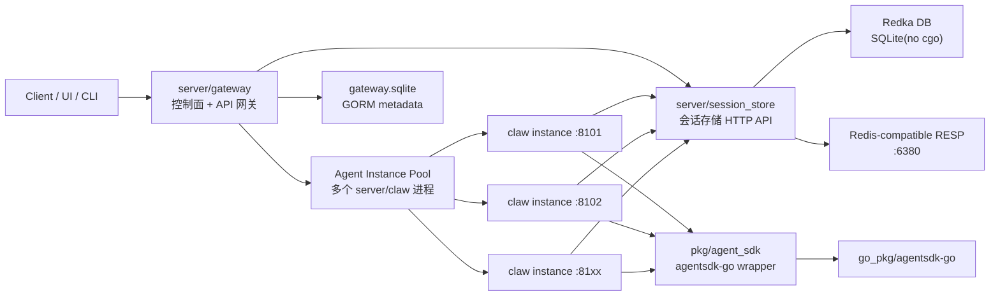
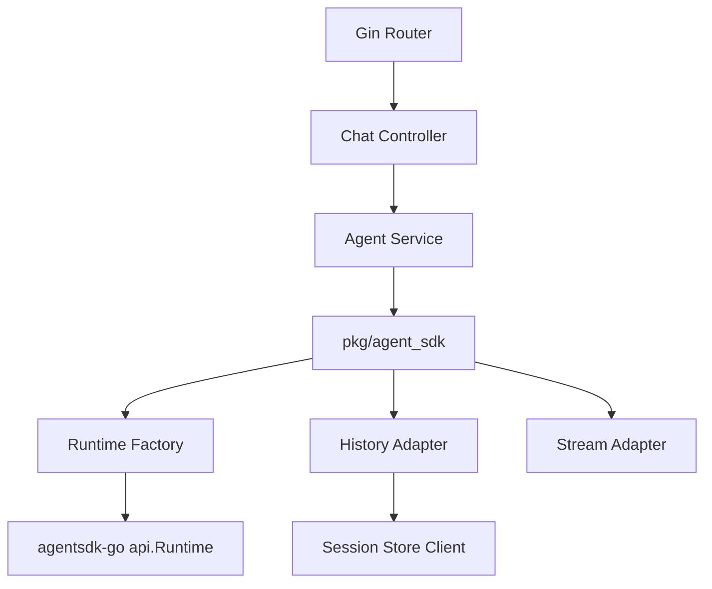
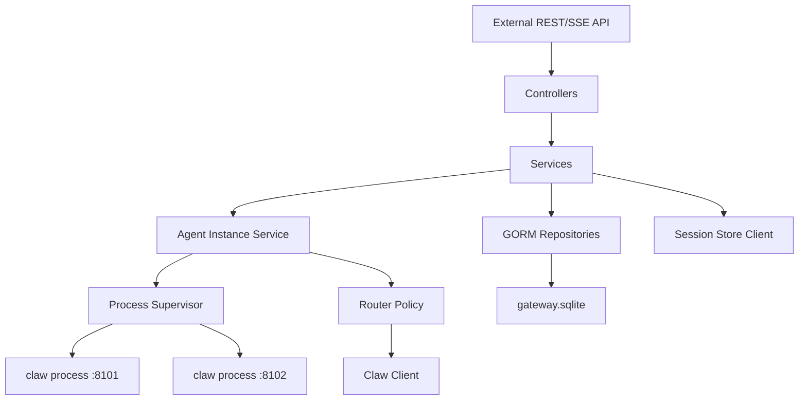
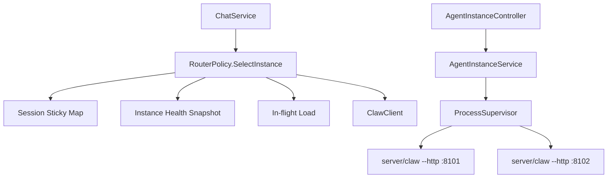
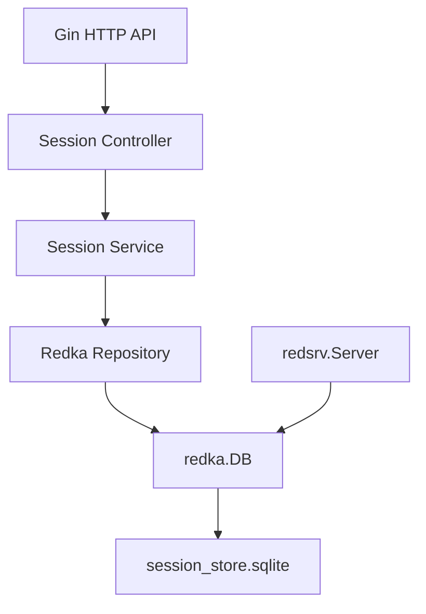
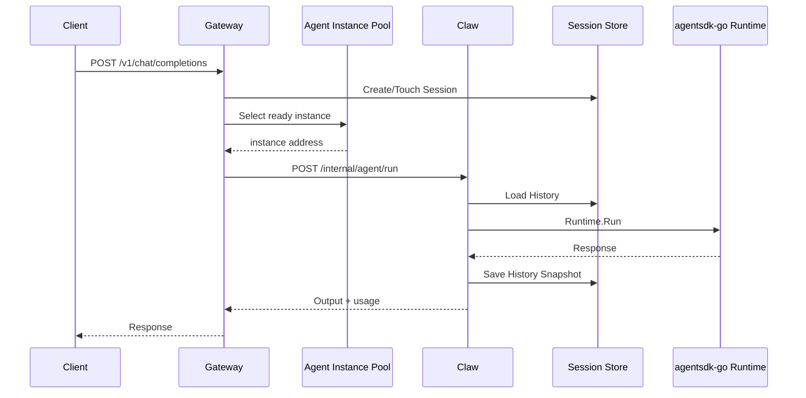
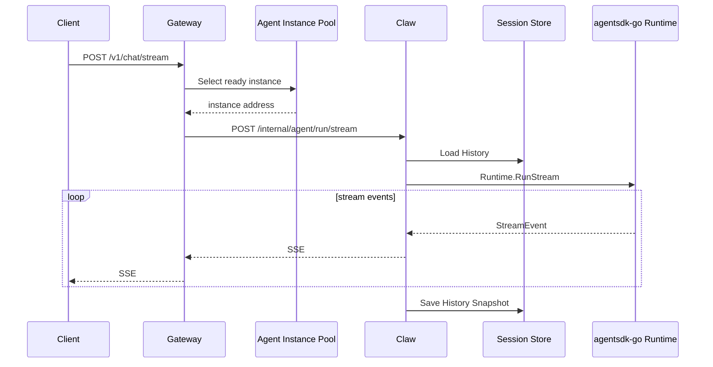

# 项目架构

## 总体架构



职责划分：

- Gateway 是唯一对外入口，负责控制面资源、Agent 服务实例生命周期、对话入口、鉴权、限流与路由。
- Claw 只负责执行 Agent，不保存控制面元数据。
- Session Store 是会话数据的唯一事实来源，提供 HTTP API 和 Redis-compatible 端口。

## 推荐目录结构

```text
server/
  claw/
    cmd/claw/main.go
    internal/
      app/
      config/
      controller/
      dto/
      middleware/
      router/
      service/
      transport/
      di/
    pkg/
      agent_sdk/
        client.go
        runtime_factory.go
        history_adapter.go
        stream_adapter.go
        types.go
      sessionstore/
        client.go
    go.mod

  gateway/
    cmd/gateway/main.go
    internal/
      app/
      config/
      controller/
        agent_controller.go
        agent_instance_controller.go
        chat_controller.go
        mcp_controller.go
        skill_controller.go
      dto/
      middleware/
      model/
      repository/
      router/
      service/
        agent_instance_service.go
        process_supervisor.go
        router_policy.go
      client/
        claw_client.go
        session_store_client.go
      di/
    go.mod

  session_store/
    cmd/session_store/main.go
    internal/
      app/
      config/
      controller/
      dto/
      model/
      redka/
        server.go
        store.go
        codec.go
        keys.go
      repository/
      router/
      service/
      di/
    go.mod
```

## MVC 分层规则

- `controller`: 只处理 HTTP 入参、鉴权上下文、响应码、DTO 转换。
- `service`: 承载业务流程、跨 repository/client 编排、事务边界。
- `repository`: 数据访问封装。Gateway 使用 GORM repository；Session Store 使用 Redka repository。
- `client`: 调用其他服务的 HTTP/SSE 客户端。
- `di`: 手动组装 config、DB、repository、service、controller、router。
- `model`: GORM 或业务实体，不直接暴露到 HTTP。
- `dto`: 对外 API request/response。

## Claw 内部架构



关键设计：

- `pkg/agent_sdk` 是唯一直接 import `github.com/stellarlinkco/agentsdk-go/pkg/...` 的平台封装层。
- `RuntimeFactory` 根据网关传入的 Agent Profile 构建 SDK `api.Options`。
- `HistoryAdapter` 将 `session_store` 的消息格式转换为 `agentsdk-go/pkg/message.Message`。
- 同步执行后调用 `Runtime.SessionHistory(sessionID)` 保存完整快照。
- 流式执行在 SSE channel 关闭后保存完整快照。
- Runtime 生命周期：
  - MVP：按请求配置创建 Runtime，运行后关闭，简单但开销较大。
  - P1：按 `agent_profile_hash` 缓存 Runtime，配置变更后失效。

## Gateway 内部架构



控制面聚合：

- AgentService：管理 agent profile、模型配置、工具权限、sandbox。
- AgentInstanceService：管理多个 Claw 实例的启动、停止、重启、健康检查、draining 和实例路由。
- MCPService：管理 MCP server spec、健康检查、工具缓存。
- SkillService：管理 skill 元数据、启用状态、路径/内容。
- ChatService：创建会话、发送消息、转发 SSE、查询历史。

## Agent 实例池架构



实例路由策略：

- `sticky_session`: 默认策略，`session_id` 首次命中某实例后写入 sticky mapping，后续请求优先同一实例。
- `least_inflight`: 在无 sticky mapping 或实例不可用时，选择进行中请求数最少的 ready 实例。
- `profile_affinity`: 可选策略，同一个 AgentProfile 优先路由到绑定该 profile 的实例池。

进程生命周期：

- `starting`: 进程已启动，等待 `/health` 成功。
- `ready`: 可接收新请求。
- `draining`: 不接收新请求，等待已有请求完成。
- `stopped`: 已正常停止。
- `failed`: 进程退出或健康检查连续失败。

端口分配：

- Gateway 配置端口范围，例如 `8101-8199`。
- 启动实例时从空闲端口池分配端口，记录到 `agent_instances`。
- 进程参数建议包含 `--http-addr 127.0.0.1:{port}`、`--session-store-url`、`--internal-token`。

## Session Store 内部架构



Redka 键设计：

- `sess:{session_id}:meta`: Hash，保存 session 元数据。
- `sess:{session_id}:messages`: List，保存消息 JSON。
- `sess:{session_id}:runs`: List，保存 run 摘要 JSON。
- `sess:{session_id}:events:{run_id}`: List，保存需要持久化的运行事件。
- `idx:user:{user_id}:sessions`: Sorted Set，按更新时间索引会话。
- `idx:agent:{agent_id}:sessions`: Sorted Set，按更新时间索引会话。

## 请求链路

### 同步对话



### 流式对话



## 服务端口建议

- Gateway HTTP: `:8080`
- Claw internal HTTP: `:8101-8199`，由 Gateway 为多个实例动态分配。
- Session Store HTTP: `:8082`
- Session Store RESP: `:6380`

## 部署形态

MVP 单机多进程：

- 每个服务独立 SQLite 文件。
- Gateway 配置 Claw 可执行文件路径、端口范围与 Session Store 地址。
- Gateway 启动并管理一个或多个 Claw 本地进程。
- Session Store 内部启动 Redka DB 和 RESP server。

后续可演进：

- Gateway 水平扩展。
- Claw 多副本 + 网关按 session hash/sticky mapping 路由，或接入任务队列。
- Claw 实例从本地进程扩展到远程节点、容器或 Kubernetes workload。
- Session Store 从 SQLite 切换 PostgreSQL backend，保持 Redka API 层不变。
