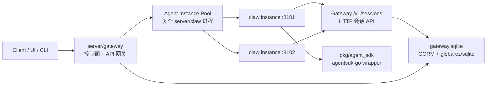
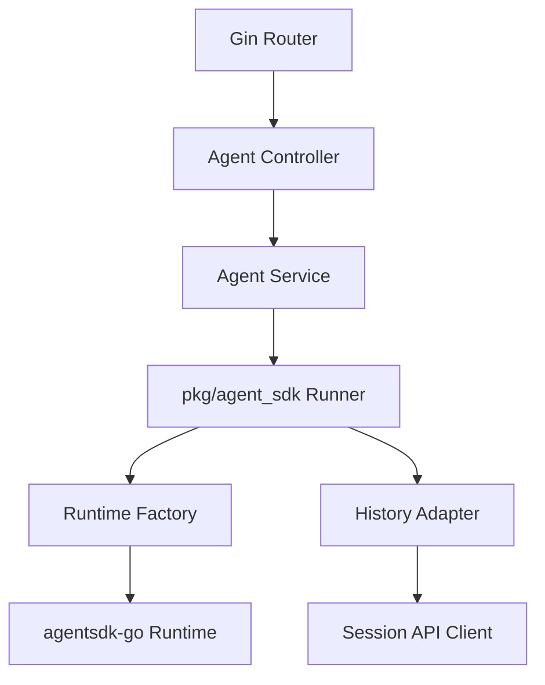
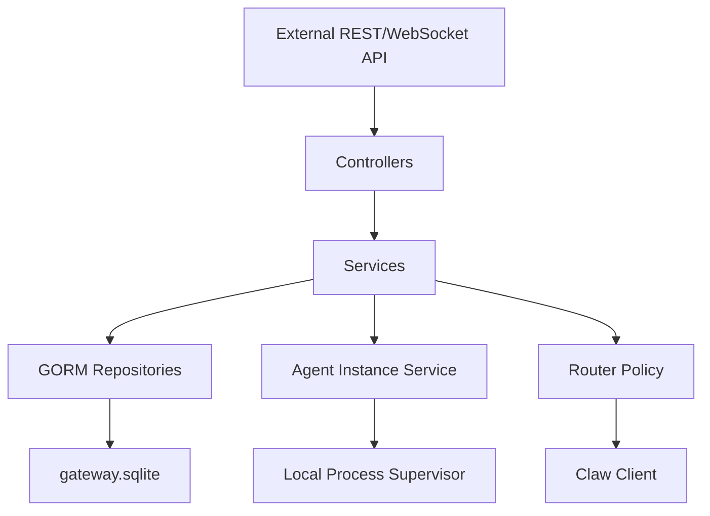
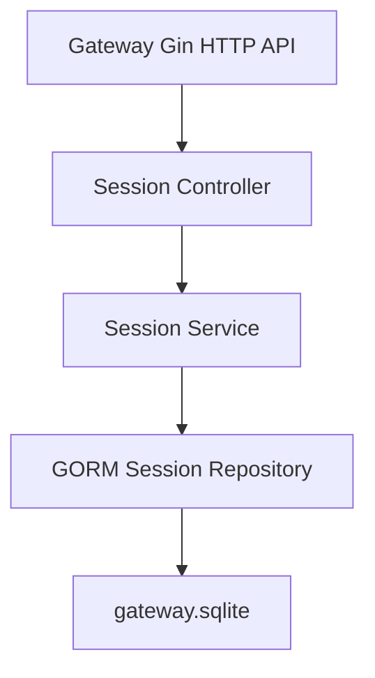
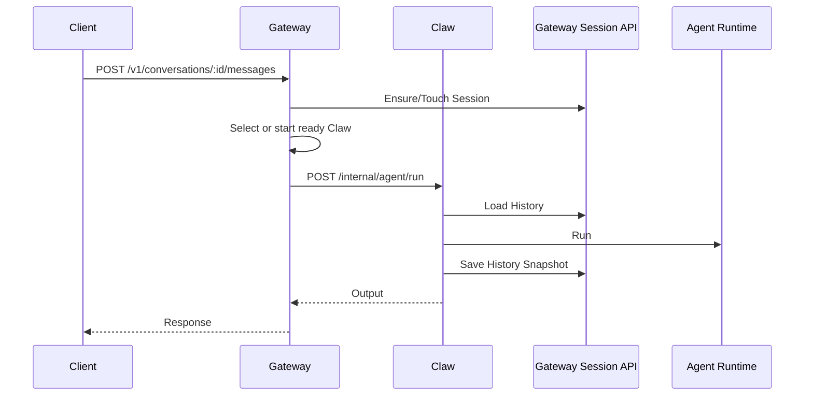

# 项目架构

## 总体架构



职责划分：

- Gateway 是唯一对外入口，负责控制面资源、Agent 实例生命周期、对话入口和路由。
- Claw 只负责执行 Agent，不保存控制面元数据。
- Gateway 内置会话 API 是会话数据的唯一事实来源，使用 GORM + no-cgo SQLite。

## 目录结构

```text
server/
  gateway/
    cmd/gateway/main.go
    internal/
      config/
      controller/
      dto/
      model/
      repository/
      router/
      service/
      client/
      di/

  claw/
    cmd/claw/main.go
    internal/
      config/
      controller/
      middleware/
      router/
      service/
      di/
    pkg/
      agent_sdk/
      sessionstore/

```

## 分层规则

- `controller`: HTTP 入参、响应码、DTO 转换。
- `service`: 业务流程、跨 repository/client 编排。
- `repository`: 数据访问。Gateway 使用 GORM repository。
- `client`: 服务间 HTTP / WebSocket / 内部流式客户端。
- `di`: 手动组装 config、DB、repository、service、controller、router。
- `model`: GORM 或业务实体，不直接暴露到 HTTP。
- `dto`: 对外 API request/response。

## Claw 内部架构



关键设计：

- `pkg/agent_sdk` 是平台封装层。
- `HistoryAdapter` 将会话 API 的消息格式转换为 SDK message。
- 同步执行后保存完整 history snapshot。
- 流式执行结束后保存完整 history snapshot。
- `runner_mode = "fake"` 可用于本地端到端测试。

## Gateway 内部架构



实例路由策略：

- `sticky_session`: 同一 conversation/session 优先使用已绑定的 ready 实例。
- `least_inflight`: 无 sticky 或 sticky 不可用时选择 inflight 最少的 ready 实例。
- `auto_start`: 无 ready 实例时按需启动一个 Claw 实例。

实例状态：

- `starting`: 进程已启动，等待 `/health`。
- `ready`: 可接收新请求。
- `draining`: 不接收新请求，等待 inflight 清零。
- `stopped`: 已停止。
- `failed`: 健康检查失败或启动失败。

Gateway 启动 Claw 时会生成实例专用 TOML 配置文件，并使用 `claw --config <file>` 启动。

Gateway 外部流式通道使用 WebSocket：

- `GET /v1/ws/chat`
- client -> gateway: `chat.start` / `chat.cancel` / `ping`
- gateway -> client: `session.accepted` / `message.delta` / `message.completed` / `message.error` / `cancel.accepted` / `pong`

Gateway 当前仍复用到 Claw 的既有流式执行链路，对外只负责把内部 stream event 翻译成 WebSocket 事件。

## Gateway 会话 API 内部架构



GORM 模型：

- `sessions`: session 元数据与 revision。
- `messages`: 会话消息。
- `runs`: agent run 摘要。
- `run_events`: run 事件。

## 同步对话链路



## 服务端口建议

- Gateway HTTP: `:8080`
- Claw internal HTTP: `:8101-8199`
## 部署形态

MVP 单机多进程：

- Gateway 使用单个 SQLite 文件保存控制面与会话数据。
- Gateway 与 Claw 使用 TOML 配置。
- Gateway 本机启动并管理多个 Claw 进程。

后续可演进：

- Gateway 水平扩展。
- Claw 从本地进程扩展到远程节点、容器或 Kubernetes workload。
- 会话存储从 SQLite 切换 PostgreSQL，保持 repository/service API 不变。
