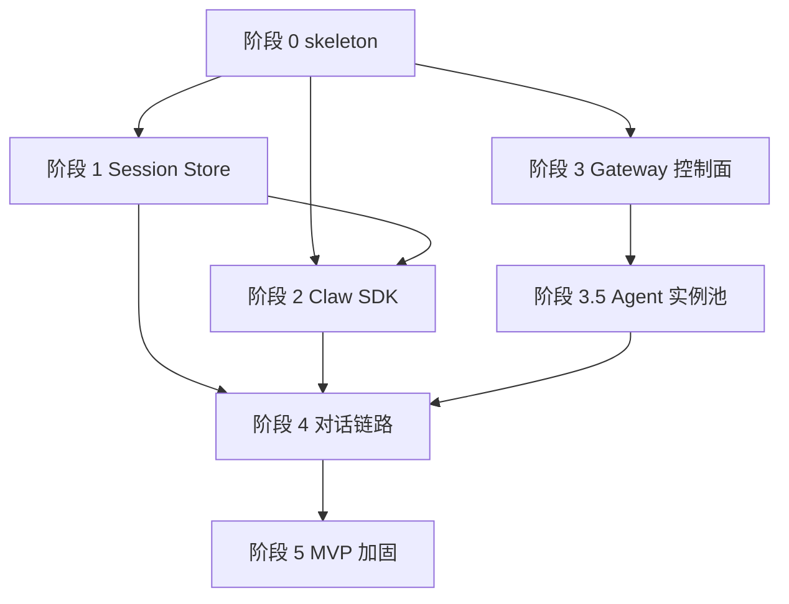

# 开发计划：多 Worker 并行

## 总体原则

- 先打通最短链路：Gateway -> Claw -> agentsdk-go -> Session Store。
- 各 worker 写入范围尽量隔离，避免重复修改同一文件。
- 每个服务先建立 skeleton、配置、健康检查、DI，再补业务。
- MVP 先使用 fake/demo model 跑通链路，再接真实 Anthropic/OpenAI 配置。

## 阶段 0：项目骨架

目标：三个服务可编译、可启动、健康检查通过。

Worker A：Workspace/Go module

- 建立 `go.work`。
- 建立三个服务 `go.mod`。
- 配置本地 replace 到 `go_pkg/agentsdk-go`、`go_pkg/redka`。
- 添加基础 Makefile 或 task 脚本。

Worker B：Gateway skeleton

- 建立 Gin app、config、DI、health route。
- 接入 GORM + `github.com/glebarez/sqlite`。
- 完成基础 migration。

Worker C：Claw skeleton

- 建立 Gin app、config、DI、health route。
- 建立 `pkg/agent_sdk` 包接口。
- 暂用 fake runner 返回固定响应。

Worker D：Session Store skeleton

- 建立 Gin app、config、DI、health route。
- 接入 Redka + `modernc.org/sqlite`。
- 启动 RESP server。

验收：

- `go test ./...` 至少在三个服务内通过。
- `GET /health` 均返回 ok。

## 阶段 1：会话存储闭环

Worker D1：Redka Repository

- 实现 session meta CRUD。
- 实现 messages append/list/replace。
- 实现 runs append/list。
- 增加 key 编码测试。

Worker D2：Session Store HTTP API

- 实现 `/v1/sessions`。
- 实现 `/messages` 与 `/messages/snapshot`。
- 实现错误码与请求校验。

Worker C1：Claw Session Client

- 实现 `server/claw/pkg/sessionstore` HTTP client。
- 实现 message DTO 与 SDK message 转换。

验收：

- Session Store 可保存并读取一组 user/assistant messages。
- Claw client 集成测试可读写临时 Session Store。

## 阶段 2：Claw 集成 agentsdk-go

Worker C2：Runtime Factory

- 实现 AgentProfile -> `api.Options` 映射。
- 支持 Anthropic/OpenAI provider 配置。
- 支持 MCPServers、SystemPrompt、Sandbox、MaxIterations、ToolWhitelist。

Worker C3：Runner

- 实现 `Run`。
- 实现 `RunStream` -> SSE event adapter。
- 接入 `HistoryLoader`。
- 运行结束后保存 `SessionHistory` 快照。

Worker C4：错误处理与并发

- 将 `api.ErrConcurrentExecution` 映射为 `409 session_busy`。
- 添加 timeout、body limit、request_id。
- fake model 测试同步与流式。

验收：

- Claw 单服务可在 fake model 下完整执行并持久化会话。
- 使用真实 API key 时可完成最小对话。

## 阶段 3：Gateway 控制面

Worker B1：Agent 管理

- AgentProfile model/repository/service/controller。
- CRUD API。
- 参数校验。

Worker B1.5：Agent 实例管理

- AgentInstance model/repository/service/controller。
- ProcessSupervisor：启动、停止、重启本地 `server/claw` 进程。
- 端口池管理：从配置端口范围分配空闲端口。
- 健康检查：轮询实例 `/health`，维护 `starting/ready/draining/stopped/failed` 状态。
- RouterPolicy：实现 session sticky + least inflight fallback。

Worker B2：MCP 管理

- MCPServer model/repository/service/controller。
- spec 校验与启用/禁用。
- P1 再做工具列表探测缓存。

Worker B3：Skills 管理

- Skill model/repository/service/controller。
- 启用/禁用、元数据保存。
- P1 再做文件同步到 `.agents/skills`。

Worker B4：Conversation 管理

- Conversation model/repository/service/controller。
- 创建会话。
- 查询消息时调用 Session Store。

验收：

- Gateway 可管理 Agent/MCP/Skill 基础资源。
- Gateway 可启动至少两个 Claw 实例，并看到健康状态。
- Gateway 可创建 conversation 并关联 agent/session。

## 阶段 4：对话链路

Worker B5：Claw Client

- 实现 Gateway -> 选中 Claw 实例的同步调用。
- 实现 Gateway -> 选中 Claw 实例的 SSE 转发。
- 处理错误码映射。

Worker B6：Chat Service

- `POST /v1/conversations/:id/messages`。
- `POST /v1/conversations/:id/stream`。
- 调用 Session Store touch session。
- 调用 RouterPolicy 选择或拉起 Claw 实例。
- 更新 conversation last_message_at。

Worker C5：Claw API Contract

- 固化 `/internal/agent/run`。
- 固化 `/internal/agent/run/stream`。
- 补充 contract tests。

验收：

- Client 调 Gateway 同步对话，消息落库。
- Client 调 Gateway 流式对话，SSE 正常输出，结束后消息落库。
- 同一 session 的连续请求默认路由到同一 ready Claw 实例。

## 阶段 5：MVP 加固

Worker E1：配置与启动体验

- `.env.example`。
- 本地启动说明。
- 默认 SQLite 文件路径。

Worker E2：测试与 CI

- 三服务 `go test ./...`。
- 关键集成测试。
- 可选 race test。

Worker E3：可观测性

- 统一日志中间件。
- request_id/session_id 透传。
- 基础耗时日志。

Worker E4：安全基线

- body size limit。
- internal token。
- MCP spec allowlist。
- tool whitelist 默认关闭危险工具。

验收：

- README 能指导本地启动三服务。
- MVP API 手动验证通过。
- 文档与接口一致。

## 并行依赖关系

## Worker 边界

| Worker | 主要写入范围 |
|---|---|
| A | `go.work`、根脚本、共享文档 |
| B 系列 | `server/gateway/**` |
| C 系列 | `server/claw/**` |
| D 系列 | `server/session_store/**` |
| E 系列 | 跨服务配置、测试、README，但必须在功能稳定后进行 |

## 风险与缓解

- SDK history 没有 saver：由 Claw wrapper 结束后保存快照。
- 同 session 并发冲突：MVP 返回 `409 session_busy`，后续加队列。
- Gateway 管理本地 Claw 多进程会带来端口泄漏和僵尸进程风险：使用端口池、PID 记录、启动超时、draining 停止和进程退出回收。
- Redka 无 Streams：流式事件若需持久化，用 List 按 run_id 存储。
- no-cgo SQLite 兼容：Gateway 用 `glebarez/sqlite`，Redka 用 `modernc.org/sqlite`，禁止引入 `mattn/go-sqlite3` 到服务模块。
- MCP 任意命令风险：Gateway 校验 spec，Claw 只接收已审核配置。
