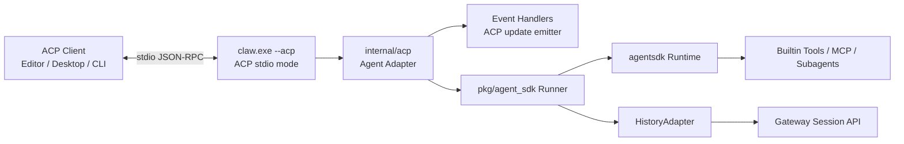
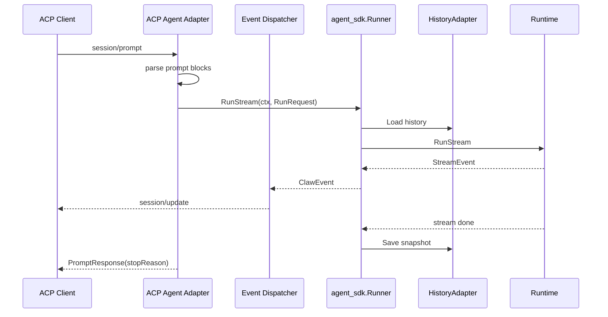
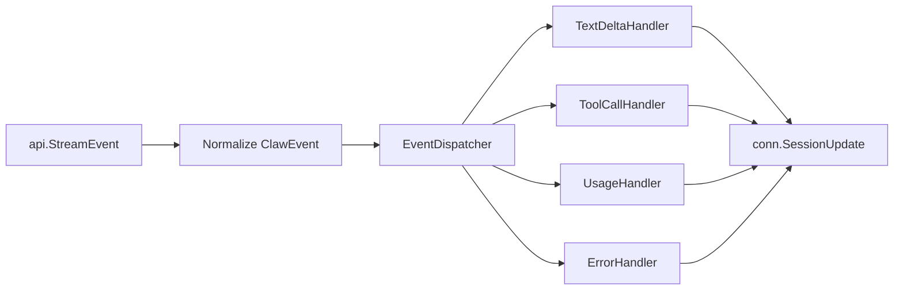
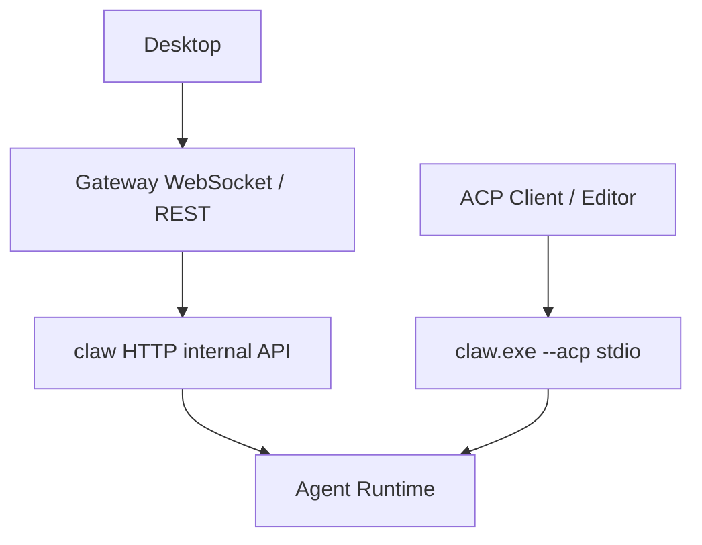

# ACP 协议实现设计

## 背景

当前 `server/claw` 已经具备 Agent Runtime、流式执行、工具调用、MCP、会话历史加载与快照保存能力，但它对外暴露的是内部 HTTP/SSE 接口：

- `POST /internal/agent/run`
- `POST /internal/agent/run/stream`

ACP(Agent Client Protocol) 是编辑器或桌面客户端与 Agent 之间的标准 JSON-RPC 协议。`github.com/coder/acp-go-sdk` 提供了 Agent 侧和 Client 侧的 stdio 连接封装。基于 SDK 的集成方式应作为 `claw` 的一个协议适配层，而不是重写现有 Agent Runtime。

本文设计基于 `github.com/coder/acp-go-sdk v0.13.0`。

## 目标

- 在 `server/claw` 内新增 ACP Agent 入口，支持 ACP client 通过 stdio 连接。
- 使用事件处理方式把现有 Agent Runtime 的流式事件转换为 ACP `session/update`。
- 复用现有 `agent_sdk.Runner`、`RuntimeFactory`、`HistoryAdapter`、会话存储和工具执行能力。
- 保持 Gateway 和桌面端现有 WebSocket 对话链路不被破坏。
- 支持多会话、多轮对话、取消、关闭会话。
- 为后续 ACP 文件、权限、终端、MCP、供应商配置能力预留扩展点。

## 非目标

- 第一阶段不把 Gateway 外部 API 改成 ACP。
- 第一阶段不要求桌面端必须作为 ACP client；桌面端仍可继续通过 Gateway WebSocket 对话。
- 第一阶段不迁移现有 HTTP/SSE 内部接口。
- 第一阶段不通过 ACP unstable providers 接口替代 Gateway 已有的供应商管理。

## 总体方案

在现有 `claw.exe` 中新增 `--acp` 运行模式，将 ACP JSON-RPC 方法映射到现有 `agent_sdk.Runner`：



不新增独立可执行文件，复用当前入口：

```text
server/claw/cmd/claw/main.go
```

`--acp` 模式下不能启动 HTTP 服务，stdout 必须只输出 ACP JSON-RPC 数据。所有 banner、健康信息、调试日志必须写入 stderr 或文件。

## 目录设计

```text
server/claw/
  cmd/
    claw/
      main.go
  internal/
    acp/
      agent.go              # 实现 acp.Agent
      session_store.go      # ACP 会话状态与取消管理
      prompt_parser.go      # ACP ContentBlock -> RunRequest
      event.go              # Claw 内部归一化事件
      event_mapper.go       # Runtime stream event -> ACP SessionUpdate
      event_dispatcher.go   # 按事件类型分发处理
      config_extension.go   # 后续扩展: 模型与供应商配置
    di/
      runner.go             # 抽出 Runner 组装，供 HTTP 和 ACP 入口复用
```

依赖新增：

```text
github.com/coder/acp-go-sdk v0.13.0
```

## ACP Agent 生命周期

`claw.exe --acp` 启动流程：

1. 解析 `--config` 和 `--acp`。
2. 读取 `--config`，复用 `server/claw/internal/config`。
3. 组装 `agent_sdk.Runner` 和 `HistoryAdapter`。
4. 如果未启用 `--acp`，继续执行当前 HTTP 服务启动逻辑。
5. 如果启用 `--acp`，创建 `internal/acp.Agent`。
6. 通过 `acp.NewAgentSideConnection(agent, os.Stdout, os.Stdin)` 建立 stdio 协议连接。
7. 阻塞等待连接断开。

伪代码：

```go
func main() {
  cfgPath, acpMode := parseFlags()
  if acpMode {
    runner := di.NewRunner(cfgPath)
    agent := acpadapter.NewAgent(runner)
    conn := acp.NewAgentSideConnection(agent, os.Stdout, os.Stdin)
    agent.SetConnection(conn)
    <-conn.Done()
    return
  }

  container := di.NewContainer(cfgPath)
  container.Run()
}
```

## ACP 方法映射

| ACP 方法 | 第一阶段处理 | 说明 |
| --- | --- | --- |
| `initialize` | 返回协议版本和能力 | 声明文本 prompt、会话关闭能力；不声明未实现能力。 |
| `authenticate` | 返回空响应 | 模型鉴权由 Provider 配置或环境变量处理。 |
| `session/new` | 创建本地 ACP session | 保存 `cwd`、`additionalDirectories`、`mcpServers`、默认 agent profile。 |
| `session/prompt` | 调用 `Runner.RunStream` | 通过事件处理实时发送 `session/update`，结束后返回 `PromptResponse`。 |
| `session/cancel` | 取消当前 turn | 调用 session 内保存的 `context.CancelFunc`。 |
| `session/close` | 取消并释放 session | 需要在 `initialize` 中声明 close 能力。 |
| `session/list` | 暂不支持 | 返回 `acp.NewMethodNotFound`，不声明 list 能力。 |
| `session/resume` | 暂不支持 | 后续可接入 Gateway 会话列表和历史恢复。 |
| `session/set_config_option` | 暂不支持 | 后续用于模型、工具白名单、sandbox 等配置。 |
| `session/set_mode` | 暂不支持 | 后续可映射到 planning / normal / readonly 等模式。 |
| unstable providers | 暂不支持 | Gateway 已有供应商管理，后续再桥接。 |

## 会话状态模型

每个 ACP session 只维护协议层必要状态，真实消息历史仍由现有 `HistoryAdapter` 负责加载和保存。

```go
type Session struct {
  ID string
  CWD string
  AdditionalDirectories []string
  MCPServers []acp.McpServer
  AgentProfile map[string]any
  ActiveCancel context.CancelFunc
  ActiveRequestID string
}
```

状态规则：

- `session/new` 创建 session id，可使用 `github.com/google/uuid` 或现有 `sess_` 风格 ID。
- `session/prompt` 开始时检查是否已有运行中的 turn。
- 如果同一 session 已在运行，返回 session busy 错误，不自动取消上一轮。
- `session/cancel` 只取消对应 session 的当前 turn。
- `session/close` 等价于先 cancel 再从 session map 中删除。
- 不同 session 可以并发运行，互不阻塞。

## Prompt 处理链路



`PromptRequest` 到 `RunRequest` 的转换：

| ACP 字段 | RunRequest 字段 | 说明 |
| --- | --- | --- |
| `sessionId` | `SessionID` | 使用 ACP session id。 |
| `messageId` | `RequestID` | 如果没有 messageId，则生成 request id。 |
| `prompt[]` 文本块 | `Prompt` | 合并 text content。 |
| `prompt[]` resource link | `Metadata.acp_resources` | 第一阶段只记录，不内联读取。 |
| `session.cwd` | `Agent.project_root` | 作为项目根目录。 |
| `session.mcpServers` | `Agent.mcp_servers` | 转换为 runtime 支持的 MCP 配置引用。 |
| session 模型配置 | `Agent.model_provider/base_url/api_key/model_name` | 后续由 config option 或 extension 写入。 |

模型配置来源优先级：

1. ACP session 扩展配置。
2. `claw.exe --acp` 启动环境变量：`ICOO_AGENT_MODEL_PROVIDER`、`ICOO_AGENT_MODEL_NAME`、`ICOO_AGENT_API_KEY`、`ICOO_AGENT_BASE_URL`。
3. `claw` 配置文件默认值。

API Key 只能保存在进程内存或安全配置中，不写入 session message、run event、日志和 ACP update。

## 事件处理设计

ACP 适配层不应在 `Prompt` 方法中直接拼接协议消息。推荐把 Runtime stream 转换为内部归一化事件，再由 handler 发送 ACP update。



建议定义：

```go
type EventHandler interface {
  Handle(ctx context.Context, session *Session, event ClawEvent) error
}

type ClawEvent struct {
  Type string
  SessionID string
  RequestID string
  MessageID string
  ToolCallID string
  Name string
  Text string
  DeltaType string
  RawInput any
  RawOutput any
  Usage *Usage
  IsError bool
}
```

当前 `agent_sdk.StreamEvent` 只有 `Type` 和 `Output`，会丢失 tool id、tool name、usage、content block input 等信息。为了完整支持 ACP，需要先扩展 `pkg/agent_sdk.StreamEvent`，或新增一个 ACP 专用 runner stream，保留 `sdk/api.StreamEvent` 的关键字段。

## 事件映射表

| Runtime 事件 | ACP update | 处理策略 |
| --- | --- | --- |
| `agent_start` | 可选 `session_info` 或忽略 | 只用于状态追踪。 |
| `iteration_start` | 可选 `plan` | 后续可展示执行计划。 |
| `message_start` | 记录 message id | 不必立即发送。 |
| `content_block_start(text)` | 初始化文本块状态 | 不必立即发送。 |
| `content_block_delta(text_delta)` | `UpdateAgentMessageText(delta)` | 实时渲染 assistant markdown。 |
| `content_block_start(tool_use)` | `StartToolCall` | 使用 tool id/name，状态 `pending` 或 `in_progress`。 |
| `content_block_delta(input_json_delta)` | 缓冲 tool raw input | 等 tool start/result 时补充 raw input。 |
| `tool_execution_start` | `StartToolCall` 或 `UpdateToolCall(in_progress)` | 如果 content block 已启动，则更新状态。 |
| `tool_execution_output` | `UpdateToolCall(content/rawOutput)` | 追加 stdout/stderr 文本。 |
| `tool_execution_result` | `UpdateToolCall(completed/failed)` | 写入 raw output。 |
| `message_delta(usage)` | `SessionUsageUpdate` | 如果有 usage，转换 token 统计。 |
| `message_delta(stop_reason)` | 记录 stop reason | 用于最终 `PromptResponse`。 |
| `message_stop` | 不单独发送 | 等 PromptResponse 表示 turn 结束。 |
| `agent_stop` | 可选 session info | 更新 last activity。 |
| `error` | `UpdateToolCall(failed)` 或 prompt error | 有 tool id 则归属工具，否则返回 prompt 错误。 |

Tool kind 推断规则：

| Tool 名称特征 | ACP ToolKind |
| --- | --- |
| read, list, view | `read` |
| edit, write, patch | `edit` |
| delete, remove | `delete` |
| move, rename | `move` |
| search, grep, find | `search` |
| shell, command, terminal, exec | `execute` |
| fetch, http | `fetch` |
| 其他 | `other` |

## 取消与并发

`session/prompt` 为每一轮创建独立 context：

```go
ctx, cancel := context.WithCancel(parent)
session.ActiveCancel = cancel
events, err := runner.RunStream(ctx, req)
```

取消规则：

- ACP client 调用 `session/cancel` 后，adapter 触发 `cancel()`。
- `Runner.RunStream` 感知 context 取消后关闭事件流。
- `Prompt` 返回 `StopReasonCancelled`。
- 如果取消发生在 permission/file/terminal client request 等待期间，也必须返回 cancelled。

并发规则：

- 不同 session 可以并发执行。
- 同一 session 同一时刻只允许一个 active prompt。
- session map 和 active cancel map 必须加锁。
- `SessionUpdate` 发送失败时终止当前 prompt，并清理 active 状态。

## 权限、文件、终端能力

ACP 支持 Agent 向 Client 请求能力：

- `session/request_permission`
- `fs/read_text_file`
- `fs/write_text_file`
- `terminal/create`
- `terminal/output`
- `terminal/wait_for_exit`

第一阶段策略：

- 不依赖 ACP client 的文件和终端能力，继续使用 `claw` 现有工具执行链路。
- 不主动调用 `RequestPermission`，沿用 runtime 当前 sandbox / tool policy。
- 在 `initialize` 中不声明超出实际实现的能力。

后续增强：

- 将敏感工具调用前置为 `RequestPermission`。
- 对编辑器工作区文件读取优先使用 `ReadTextFile`，减少路径权限差异。
- 对 shell/terminal 工具可选代理到 ACP terminal API，让编辑器显示真实终端。

## MCP 处理

ACP `session/new` 请求包含 `mcpServers`。第一阶段有两种处理方式：

1. 如果 `claw` runtime 已能直接连接对应 MCP server，则转换为 `Agent.mcp_servers`。
2. 如果 ACP client 提供的是只适合 client 侧代理的 MCP 能力，则暂存到 session metadata，后续通过 ACP unstable MCP connect 能力桥接。

优先保持当前 `common/core/agent_sdk/mcp` 的执行模型，避免引入第二套 MCP 生命周期管理。

## Gateway 与桌面端关系

ACP 入口与现有 Gateway 链路并行存在：



这样设计有几个好处：

- 桌面端已有的供应商管理、Agent 管理、定时任务、会话列表不受影响。
- 外部编辑器可以通过 `claw.exe --acp` 直接连接 ACP。
- 后续如果桌面端要支持 ACP client，只需在桌面端新增 ACP client 管理模块，而不影响 Gateway API。

## 配置与启动

示例启动：

```powershell
$env:ICOO_AGENT_MODEL_PROVIDER="openai"
$env:ICOO_AGENT_MODEL_NAME="gpt-4.1"
$env:ICOO_AGENT_API_KEY="..."
$env:ICOO_AGENT_BASE_URL="https://api.openai.com/v1"
.\claw.exe --acp --config .\config\claw.toml
```

注意事项：

- `--acp` 模式下的 stdout 必须只给 ACP JSON-RPC 使用。
- banner、健康信息、调试日志只能输出到 stderr 或日志文件。
- HTTP 模式和 ACP 模式必须使用同一套 Runner 组装逻辑。

## 分阶段实施计划

### 阶段 1: ACP stdio MVP

- 添加 `github.com/coder/acp-go-sdk v0.13.0` 依赖。
- 在 `cmd/claw/main.go` 添加 `--acp` 参数分支。
- 实现 `internal/acp.Agent` 的 `initialize`、`authenticate`、`session/new`、`session/prompt`、`session/cancel`、`session/close`。
- 文本 prompt 转换为 `RunRequest.Prompt`。
- 文本 delta 转换为 `UpdateAgentMessageText`。
- 支持多 session 并发和同 session busy 判断。

### 阶段 2: 完整事件映射

- 扩展 `agent_sdk.StreamEvent`，保留 tool id、tool name、raw input、raw output、usage、is_error。
- 新增 `event_mapper` 和 mapper 单元测试。
- 支持 tool call start/update/completed/failed。
- 支持 usage update 和 stop reason 映射。

### 阶段 3: 配置与模型能力

- 支持 ACP session 扩展配置模型供应商、base_url、api_key、model。
- 可选实现 `session/set_config_option`，用于工具白名单、强制 skills、最大迭代次数。
- API Key 脱敏，禁止写入日志和历史。

### 阶段 4: ACP client 能力桥接

- 按需接入 `RequestPermission`。
- 按需接入 `ReadTextFile`、`WriteTextFile`。
- 按需接入 terminal API。
- 评估 unstable MCP / providers 方法是否与 Gateway 管理能力打通。

## 测试计划

单元测试：

- `prompt_parser`：文本、resource link、空 prompt、混合 content block。
- `session_store`：创建、取消、关闭、同 session busy、不同 session 并发。
- `event_mapper`：文本 delta、tool start、tool output、tool result、error、usage。
- 模型配置脱敏：API key 不进入 metadata、日志字段和 session update。

集成测试：

- 使用 `acp-go-sdk` 的 client side connection 通过 pipe 连接 `internal/acp.Agent`。
- 发送 `initialize -> session/new -> session/prompt`，断言收到实时 `session/update`。
- 发送 `session/cancel`，断言 `PromptResponse.stopReason == cancelled`。
- 使用 stub runner 模拟 Runtime 事件，不依赖真实 LLM。

手工验收：

- 外部 ACP client 可以启动 `claw.exe --acp` 并完成一轮对话。
- stdout 中没有 banner 或普通日志。
- 工具调用在 ACP client 中显示为 tool call，而不是混进 assistant 文本。
- Gateway 和桌面端原有 WebSocket 对话不受影响。

## 风险与处理

| 风险 | 处理 |
| --- | --- |
| stdout 日志污染 ACP JSON-RPC | `--acp` 模式下日志全部写 stderr 或文件。 |
| 当前 stream event 信息不足 | 阶段 2 扩展 `agent_sdk.StreamEvent`，避免只依赖 `Output`。 |
| API Key 泄漏 | session profile 只在内存保存，日志和事件统一脱敏。 |
| 同 session 并发导致历史错乱 | 同 session busy，跨 session 并发。 |
| ACP unstable 能力变化 | 第一阶段只使用稳定核心方法，unstable providers/MCP 后置。 |
| Gateway 与 ACP 双入口行为不一致 | 共用 Runner 组装、事件映射和历史适配层。 |

## 验收标准

- `claw.exe --acp` 能作为 ACP Agent 被 stdio client 初始化。
- `session/new` 返回可用 session id。
- `session/prompt` 能流式返回 assistant 文本。
- `session/cancel` 能中止运行中的 prompt。
- 至少支持两个 session 同时对话。
- ACP 实现不破坏现有 `claw` HTTP 内部接口和 Gateway WebSocket 对话。
- 设计中的事件 mapper 有可重复的单元测试覆盖。
