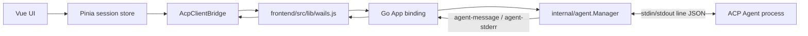
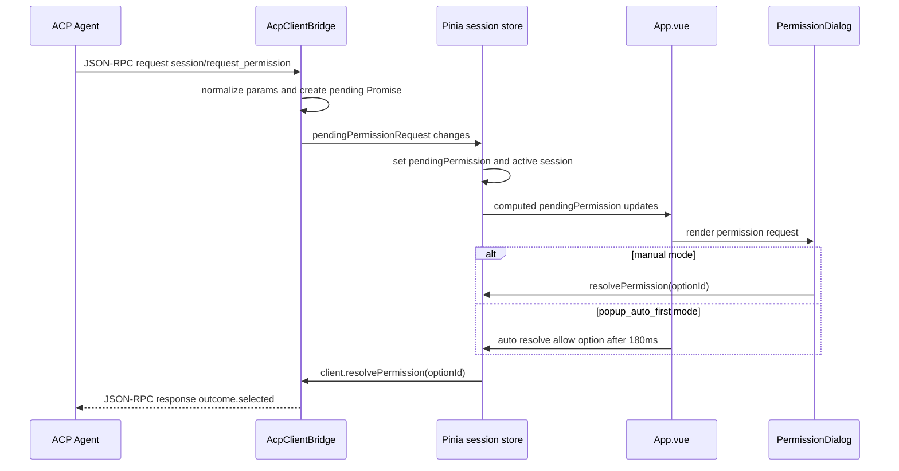

# acp_go_ui ACP 客户端交互与权限流程分析

## 背景

本文基于 `E:\codes\acp_go_ui` 当前实现，分析 ACP DESKTOP 作为 ACP Client 与本地 ACP Agent 的交互方式，重点整理前端对 `session/request_permission` 的权限确认交互。

本项目已有 [06-acp-protocol-design.md](06-acp-protocol-design.md) 说明 `server/claw` 作为 ACP Agent 的实现设计。本文从另一个方向补充：一个桌面客户端如何启动 Agent、桥接 stdio JSON-RPC、维护会话状态，并把 Agent 侧权限请求转成用户可确认的前端交互。

## 总体架构

`acp_go_ui` 是 Wails + Go + Vue 3 应用。Go 后端只负责桌面能力和 Agent 子进程通道，ACP JSON-RPC 协议封装主要在前端完成。



核心职责分布：

| 层 | 关键文件 | 职责 |
| --- | --- | --- |
| Go 进程管理 | `internal/agent/manager.go` | 启动 Agent 子进程，保存 stdin，扫描 stdout/stderr，发 Wails event。 |
| Wails 绑定 | `app/app.go` | 暴露 `SpawnAgent`、`SendToAgent`、`ReadTextFile`、`WriteTextFile` 等方法。 |
| 前端桌面桥 | `frontend/src/lib/wails.js` | 封装 Wails 方法调用和 `agent-message`、`agent-stderr` 事件监听。 |
| ACP 桥接 | `frontend/src/lib/acp-bridge.js` | 实现 JSON-RPC request/response/notification 分发，处理 Agent 反向请求。 |
| 会话状态 | `frontend/src/stores/session.js`、`session-connection.js`、`session-runtime.js` | 创建/恢复会话、发送 prompt、处理 `session/update`、管理权限 pending 状态。 |
| 权限 UI | `frontend/src/lib/authorization.js`、`frontend/src/views/auth/PermissionDialog.vue`、`frontend/src/App.vue` | 权限弹窗、授权模式、自动确认逻辑。 |

## stdio 消息通道

Agent 通过 `SpawnAgent` 启动，Go 后端使用 `exec.Cmd` 打开三个管道：

- stdin：前端调用 `SendToAgent(agentID, message)` 时，Go 写入 `message + "\n"`。
- stdout：Go 用 `bufio.Scanner` 逐行读取，每行作为一条 `agent-message` Wails 事件发给前端。
- stderr：Go 逐行读取为 `agent-stderr`，主要用于启动日志和阶段识别。

这意味着当前客户端要求 Agent 的 ACP 消息是单行 JSON-RPC。stdout 不能混入普通日志，否则前端 `AcpClientBridge.handleMessage` 会 JSON 解析失败。

## JSON-RPC 桥接模型

`AcpClientBridge` 对收到的 JSON 做三类判断：

| 类型 | 判断条件 | 处理 |
| --- | --- | --- |
| response | 有 `id`，无 `method` | 根据 `id` 找到前端发起请求的 Promise，resolve 或 reject。 |
| request | 有 `id`，有 `method` | Agent 调用客户端能力，执行后回写 JSON-RPC response。 |
| notification | 无 `id`，有 `method` | 当前主要处理 `session/update`。 |

前端主动发给 Agent 的主要 ACP 方法：

- `initialize`
- `authenticate`
- `session/new`
- `session/load`
- `session/prompt`
- `session/cancel`
- `session/set_mode`
- `session/set_model`

Agent 反向调用客户端的主要方法：

- `session/request_permission`
- `fs/read_text_file`
- `fs/write_text_file`

超时策略也在桥接层中定义：

- `session/prompt` 不设置超时，适合长任务。
- `initialize`、`authenticate`、`session/new`、`session/load` 为 180 秒。
- 其他请求为 60 秒。

## 会话生命周期

### 创建会话

`sessionStore.createSession(agentName, cwd, proxy)` 的主要流程：

1. 将代理配置转成环境变量覆盖项。
2. 调用 Wails `SpawnAgent` 启动对应 Agent。
3. 监听该 Agent 的 stderr，用于展示下载、安装、构建、启动等阶段。
4. 创建 `AcpClientBridge`，监听该 Agent 的 `agent-message`。
5. 调用 `initialize`，声明客户端文件能力。
6. 调用 `session/new`，传入 `cwd` 和空 `mcpServers`。
7. 如果需要认证，则弹出认证方式选择，调用 `authenticate` 后重试 `session/new`。
8. 保存 ACP `sessionId` 到本地 session snapshot。
9. 绑定 `session/update` 和权限 watcher。

初始化请求中的能力声明：

```json
{
  "protocolVersion": 1,
  "clientCapabilities": {
    "fs": {
      "readTextFile": true,
      "writeTextFile": true
    }
  },
  "clientInfo": {
    "name": "acp-ui",
    "title": "ACP DESKTOP",
    "version": "<app-version>"
  }
}
```

### 恢复会话

`resumeSession(savedSession)` 会重新启动 Agent，执行 `initialize` 后调用 `session/load`：

```json
{
  "sessionId": "<saved-acp-session-id>",
  "cwd": "<saved-working-directory>",
  "mcpServers": []
}
```

如果本地已有历史消息，前端会先恢复本地 UI 消息，再继续接收 Agent 的后续 `session/update`。

### 发送 Prompt

用户输入后，前端先乐观追加用户消息，再调用：

```json
{
  "sessionId": "<acp-session-id>",
  "prompt": [
    {
      "type": "text",
      "text": "<user-input>"
    }
  ]
}
```

`session/prompt` 完成后，前端记录 `stopReason`，同步本地 session snapshot，并结束 loading 状态。

### 会话更新

Agent 通过 notification 推送：

```text
session/update
```

`session-runtime.js` 当前处理的 update 类型包括：

| update 类型 | 前端行为 |
| --- | --- |
| `user_message_chunk` | 追加用户消息文本。 |
| `agent_message_chunk` | 追加助手正文。 |
| `agent_thought_chunk` | 追加助手 thought part。 |
| `tool_call` | 新建工具调用 part，并记录到 `toolCalls` map。 |
| `tool_call_update` | 更新工具状态、标题、类型、路径。 |
| `plan` | 更新当前计划面板。 |
| `current_mode_update` | 更新当前模式。 |
| `session_info_update` | 更新标题和更新时间。 |
| `available_commands_update` | 更新 `/` 命令列表。 |

## ACP 权限请求交互

### 协议入口

当 Agent 需要执行敏感操作时，会向客户端发 JSON-RPC request：

```text
session/request_permission
```

`AcpClientBridge.handleRequest` 收到后调用 `requestPermission(params)`。该方法不会立即返回，而是创建一个 Promise，并把请求标准化到响应式状态 `pendingPermissionRequest`：

```js
{
  sessionId,
  toolCall: {
    toolCallId,
    title,
    kind,
    status,
    locations
  },
  options: [
    {
      kind,
      name,
      optionId
    }
  ]
}
```

关键点是：Agent 的 JSON-RPC request 会被挂起，直到用户点击弹窗按钮或自动授权逻辑选择某个 option。前端最终把结果作为同一个 JSON-RPC request 的 response 写回 Agent。

### 状态提升

每个连接中的 runtime 都有自己的 `client.pendingPermissionRequest`。`sessionStore.attachPermissionWatcher(runtime)` 会监听这个值：

1. 如果出现新权限请求，写入全局 `pendingPermission`。
2. 记录 `pendingPermissionSessionId`。
3. 自动切换 active session 到发起权限请求的 session。
4. 如果该 runtime 的请求清空，也清空全局 pending 状态。

这让应用在多 session 场景下仍然能把权限弹窗定位到正确的 Agent runtime。真正 resolve 时，`getRuntimeForPendingPermission()` 优先使用本地 session id，兜底使用 ACP `sessionId` 查找 runtime。

### 弹窗展示

`PermissionDialog.vue` 展示的信息：

- 标题：需要权限确认。
- 工具类型：`request.toolCall.kind`。
- 命令预览：`request.toolCall.title`。
- 路径列表：`request.toolCall.locations[].path`。
- Agent 提供的 options。
- 额外的取消按钮。

按钮样式按 option kind 区分：

- `kind` 以 `reject` 开头时使用危险按钮。
- 其他 option 使用主按钮。

点击 option 后触发：

```js
sessionStore.resolvePermission(optionId)
```

返回给 Agent 的结果：

```json
{
  "outcome": {
    "outcome": "selected",
    "optionId": "<selected-option-id>"
  }
}
```

点击取消或关闭弹窗时触发：

```js
sessionStore.cancelPermission()
```

返回给 Agent 的结果：

```json
{
  "outcome": {
    "outcome": "cancelled"
  }
}
```

### 授权模式

`authorization.js` 定义了两种模式：

| 模式 | 值 | 行为 |
| --- | --- | --- |
| 手动确认 | `manual` | 弹窗等待用户选择。 |
| 弹窗自动确认 | `popup_auto_first` | 仍显示弹窗，但自动选择允许类 option。 |

自动确认策略：

1. 只在 `popup_auto_first` 模式生效。
2. 优先寻找 `kind === "allow_once"` 且有 `optionId` 的 option。
3. 找不到时寻找 `kind === "allow_always"`。
4. 找不到允许项则不自动处理。
5. `App.vue` 等待一次 `nextTick`，再延迟 180ms 调用 `handlePermissionSelect(optionId)`。
6. 使用 `sessionId + toolCallId + optionId` 生成 key，避免同一请求重复自动确认。

这个模式不是静默授权：权限弹窗仍会渲染出来，只是由前端在短延迟后自动点击允许项。

### 权限时序



## 文件能力与权限的关系

客户端在 `initialize` 中声明了 `fs/readTextFile` 和 `fs/writeTextFile`。Agent 可以直接反向调用：

- `fs/read_text_file`
- `fs/write_text_file`

当前 `acp_go_ui` 的文件读写实现会直接落到 Go 后端的 `os.ReadFile` / `os.WriteFile`，`WriteTextFile` 还会自动创建父目录。代码层没有在 `fs/write_text_file` 前强制走 `session/request_permission`；是否先请求权限取决于 Agent 自身策略。

对本项目的启示：

- 如果 `server/claw` 后续作为 ACP Agent 主动调用 Client 文件能力，应在敏感写入、删除、移动、命令执行前主动发 `session/request_permission`。
- 不应假设 ACP Client 会替 Agent 补权限策略；Client 只负责展示和返回选择。
- 对文件写入这种高风险操作，Agent 侧仍应保留自己的工具策略、路径边界和审计日志。

## 可观测性

`acp_go_ui` 的 `traffic` store 会记录 JSON-RPC 流量：

- 方向：`in` / `out`
- 类型：request / response / notification
- method
- request id
- payload
- error 标记

这对调试 ACP 实现很有价值。本项目如果要做桌面端或 Gateway ACP 调试面板，可以复用这个思路：在协议桥接层统一记录，而不是在每个业务 handler 分散打点。

## 对 icoo_claw 的参考建议

### Agent 侧

- `server/claw --acp` 的 stdout 必须只输出 JSON-RPC。普通日志、banner、调试信息统一走 stderr 或文件。
- `initialize` 只声明真实实现的能力，避免 Client 以为文件、权限、终端等能力可用。
- `session/prompt` 应支持长任务，不应依赖短超时；取消必须通过 `session/cancel` 正常中止。
- `session/update` 的 tool call 信息要尽量结构化，包括 tool id、title、kind、status、locations，方便客户端权限弹窗和工具状态 UI 复用。

### 权限协议

- 敏感工具执行前，Agent 应主动发 `session/request_permission`，并等待 Client response。
- options 建议提供清晰稳定的 `kind`：
  - `allow_once`
  - `allow_always`
  - `reject_once`
  - `reject_always`
- `optionId` 应稳定且只在本次请求上下文内有效。
- `toolCall.title` 应是用户可理解的操作预览，不要只放内部 JSON。
- `toolCall.locations` 应尽量带上关键路径，帮助客户端展示风险边界。

### Client / Gateway 侧

- 如果本项目后续实现自己的 ACP Client UI，可以采用“桥接层 Promise 挂起 + 全局 pending permission + 弹窗 resolve”的模型。
- 多会话时必须记录权限请求来源 session，resolve 时不要只依赖当前 active tab。
- 自动授权应保留可见弹窗和去重 key，避免用户完全无感，也避免重复提交同一请求。
- 文件写入、命令执行、删除、移动等操作要在 Agent 侧和平台侧都保留审计事件。

## 当前实现边界

`acp_go_ui` 的实现可作为参考，但有几个边界需要注意：

- 权限策略主要在前端交互层，缺少持久化的权限策略、审计和回滚模型。
- 文件读写 API 本身不做路径沙箱校验，依赖 Agent 请求和用户确认策略。
- 自动授权模式只按 option kind 选择允许项，没有风险分级、路径范围或工具类型约束。
- 同一时刻全局只展示一个 `pendingPermission`；多个 session 同时请求权限时，需要进一步设计队列或并发弹窗策略。
- `session/request_permission` 没有超时或过期 UI，Agent 长时间等待时用户只能手动处理。

## 推荐落地顺序

1. 在 `server/claw` ACP Agent 实现中补齐结构化 tool call update。
2. 为高风险工具增加 `session/request_permission` 发起点，并定义统一 option kind。
3. 在 Gateway 或桌面端协议层增加 ACP traffic log。
4. 设计权限审计模型，记录 Agent、session、toolCallId、kind、paths、options、selected option、时间和结果。
5. 再考虑自动授权策略；自动策略必须基于工具类型、路径范围和用户配置，而不只是 option 顺序或 kind。

