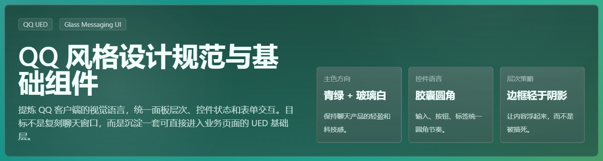
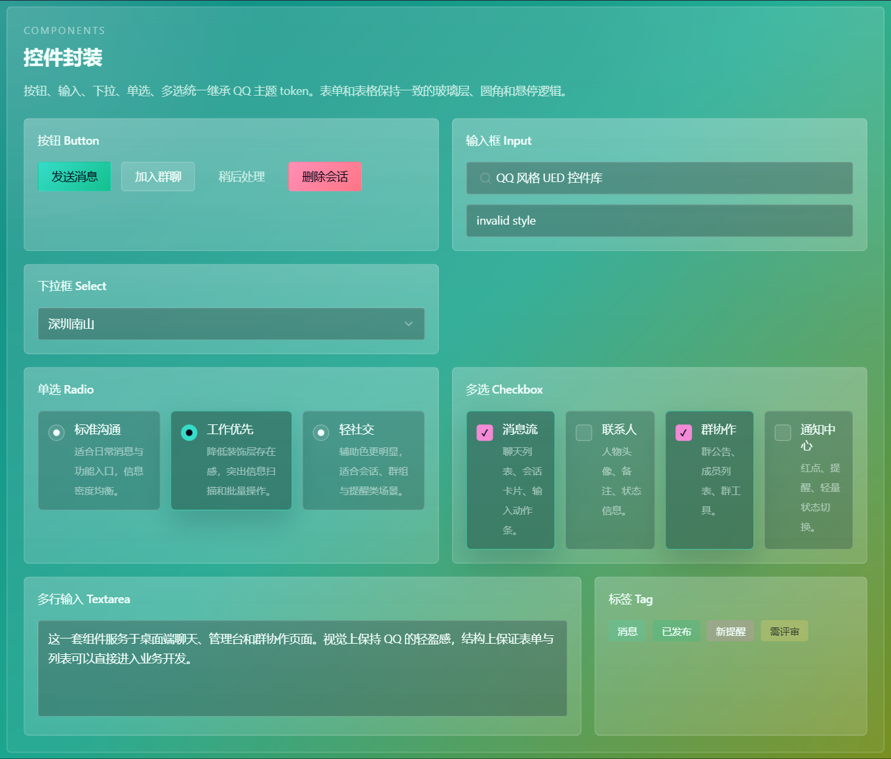
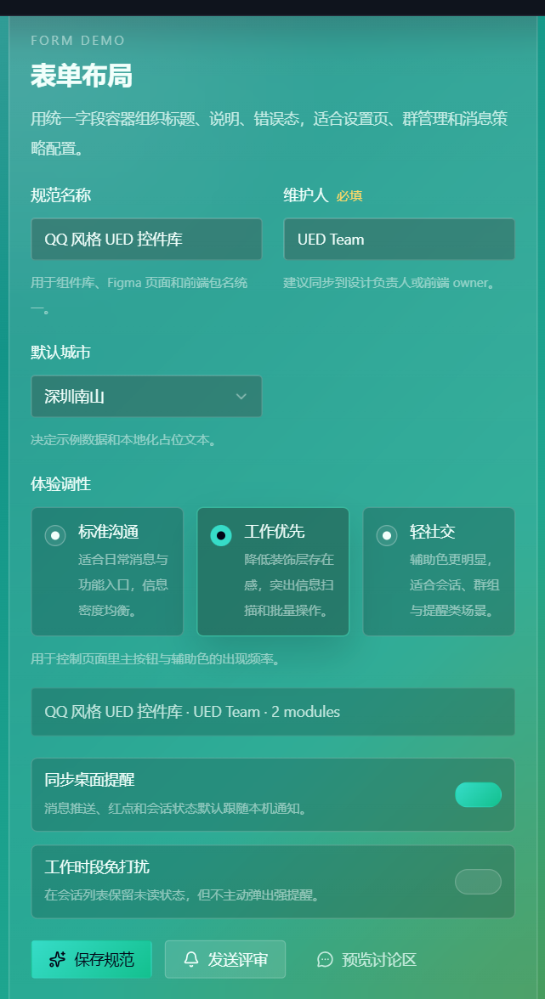
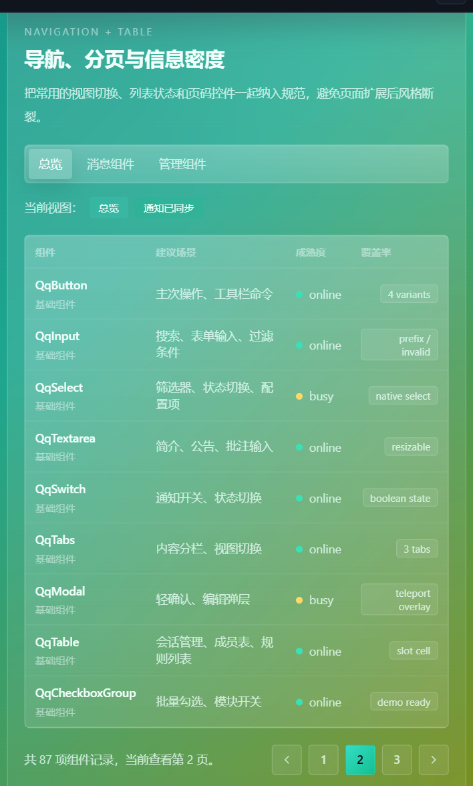
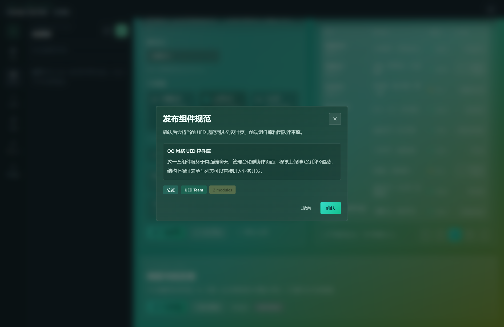

# QQ 风格 UED 设计规范

## 目标

本规范用于给 `desktop/frontend` 提供一套接近 QQ 客户端气质的基础设计语言。重点不是复刻聊天主界面，而是抽取其稳定视觉特征并封装成能复用于业务页面的组件层。风格关键字包括：青绿主色、半透明玻璃面板、粉色辅助点缀、4px 小圆角、轻量分割线、弱化卡片边界。

## 视觉原则

1. 颜色层级遵循“背景渐变 > 玻璃白高光 > 青绿主操作 > 粉色提醒”。
2. 交互控件默认低对比，悬停和聚焦时提升边框与亮度，不依赖厚重阴影。
3. 页面信息组织优先使用留白、行高和浅边框，不用大面积实色卡片堆叠。
4. 状态反馈必须轻且清楚：选中有明显色差，禁用降透明度，错误态直接切到暖色。

## Token 定义

- 主色：`#36dcc8`
- 强调色：`#13c08e`
- 辅助粉：`#f38ad5`
- 必填提示：`#ffd968`
- 主文本：`rgba(241,255,251,1)`
- 次文本：`rgba(235,255,248,0.78)`
- 面板层：`rgba(255,255,255,0.14)`
- 边框层：`rgba(255,255,255,0.18)`

尺寸统一收敛到 40/44 控件高度，圆角以 4px 为主，大容器控制在 6px 到 8px。输入框、按钮、标签、筛选器共享同一套紧凑型圆角与焦点态，padding 也统一收窄，避免占据过多空间。

## 组件范围

- `QqButton`：主按钮、次按钮、幽灵按钮、风险按钮。
- `QqInput`：支持 prefix 插槽、错误态、禁用态。
- `QqSelect`：原生下拉封装，统一主题和箭头。
- `QqTextarea`：公告、简介、说明类多行输入。
- `QqRadioGroup`：块级单选，适合设置项切换。
- `QqCheckboxGroup`：块级多选，适合模块勾选。
- `QqSwitch`：布尔开关，适合通知、免打扰、功能启停。
- `QqTag`：轻标签，用于分类、状态和筛选反馈。
- `QqTabs`：页内分栏导航。
- `QqPagination`：轻量分页切换。
- `QqModal`：玻璃态弹层，承接确认和小型编辑。
- `QqFormField` / `QqFormSection`：表单标题、说明、错误提示和分区容器。
- `QqTable`：轻分割线表格，支持插槽单元格扩展。

## 落地方式

实现层新增独立的 QQ 主题 CSS token 文件，组件通过 Vue 单文件组件封装，演示页挂在前端路由中，作为设计规范和组件验收页面。这样可以在不重写现有聊天界面的前提下，先建立稳定的 UED 基础层，并逐步向实际业务页面迁移。

## 页面截图

### 概览头图

展示整体气质、主色方向、胶囊圆角和玻璃态信息卡，是整套规范的视觉起点。

### 基础控件区

覆盖按钮、输入框、下拉框、单选、多选、Textarea、Tag 等核心交互控件，便于直接对照封装效果。

### 表单布局

展示 `QqFormField`、`QqSelect`、`QqRadioGroup`、`QqSwitch` 等组件在实际设置页里的组合方式。

### 导航、表格与分页

展示 `QqTabs`、`QqTable`、`QqPagination` 和状态 Tag 在管理型页面里的信息密度控制。

### 弹层示例

展示 `QqModal` 的玻璃态弹层效果，用于确认发布、轻编辑和二次操作。

